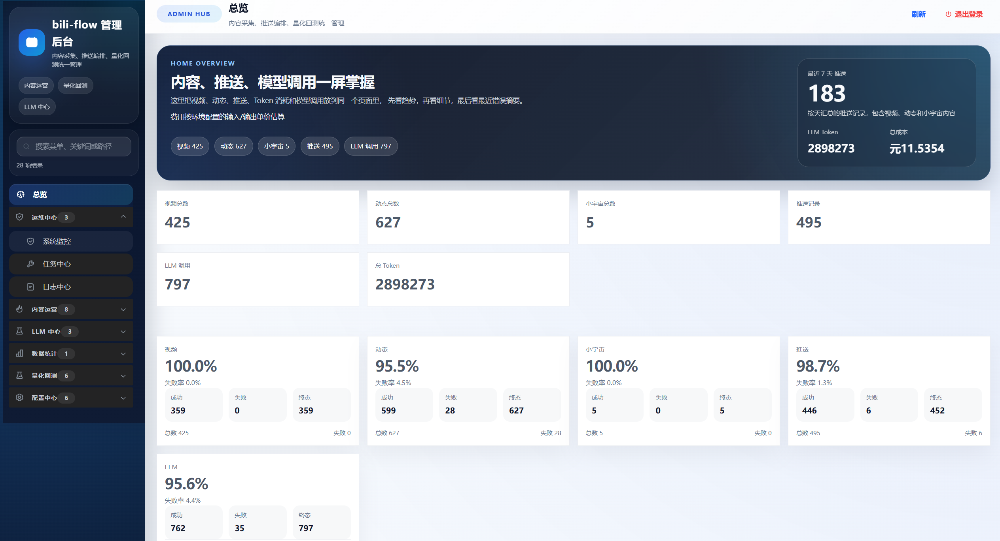
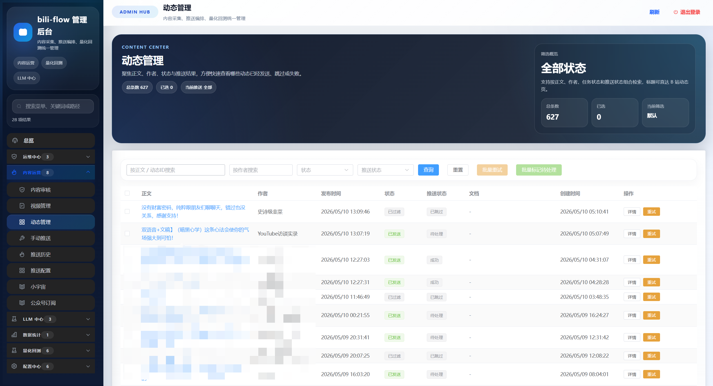
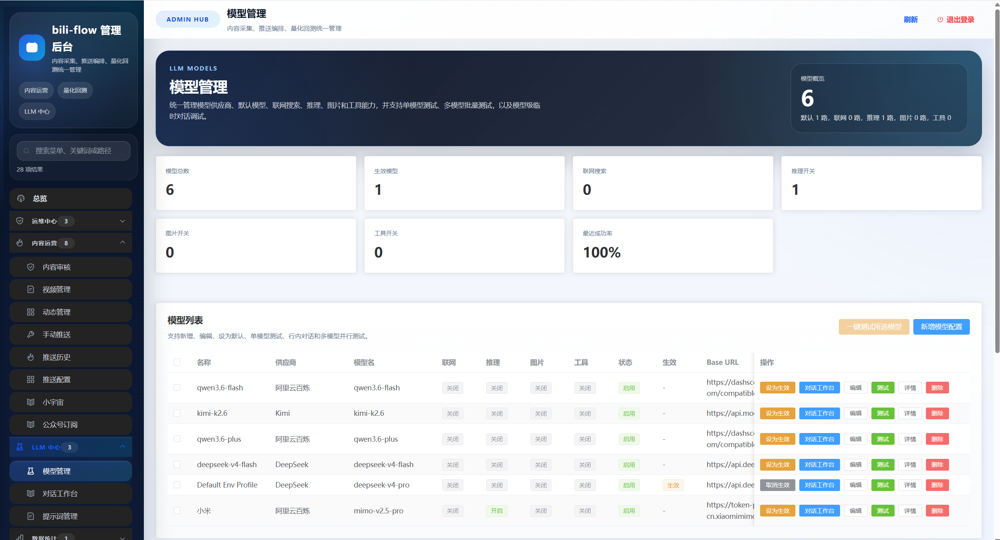
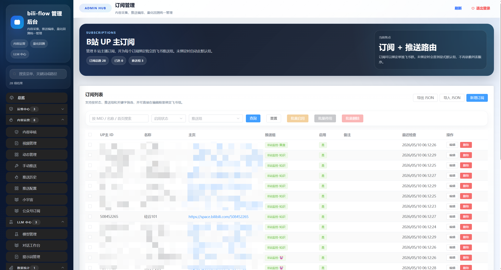
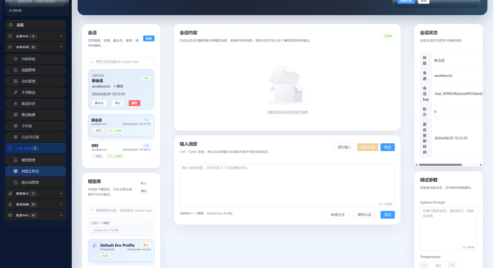
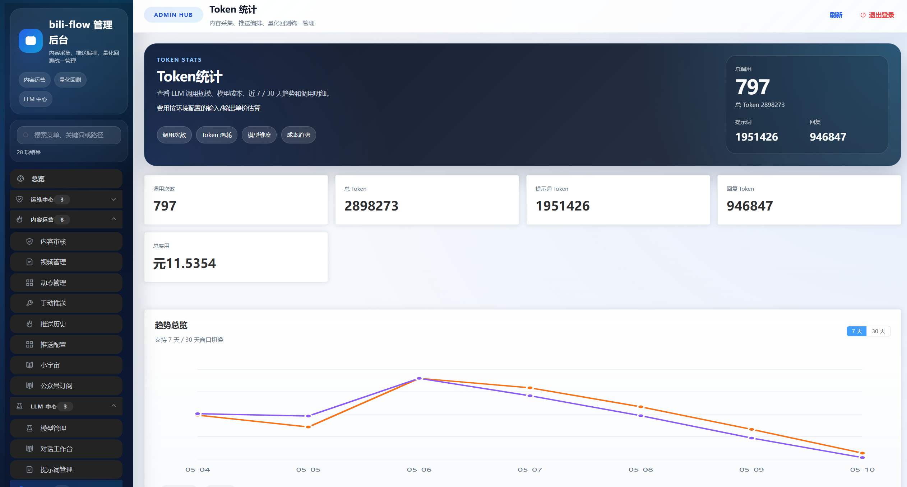
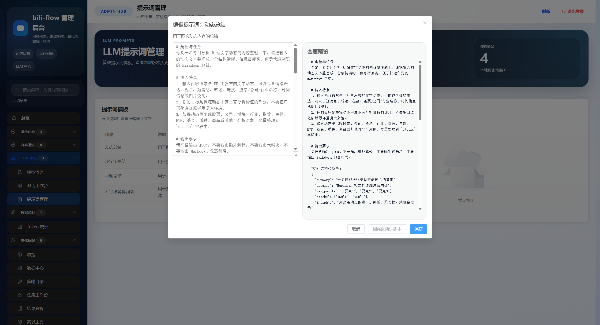

# bili-flow

`bili-flow` 是一个以 **Bilibili 内容监控与总结推送** 为核心的本地优先自动化系统。

它的主链路很明确：

**监控 B 站视频 / 动态 -> 下载音频或读取字幕 -> ASR 转写 -> LLM 总结 -> 推送到飞书**

当前仓库聚焦这条主链路，并提供管理后台、任务中心、日志中心、提示词管理和推送配置。  
如果你有自己的内容工作台，也可以把 `bili-flow` 当成一个上游内容处理器，对接到你自己的下游系统。

## 界面预览

下面是当前 `bili-flow` 的几张核心页面截图，方便你快速确认主要功能入口。

| 总览 | 动态管理 |
| --- | --- |
|  |  |

| 模型管理 | 订阅管理 |
| --- | --- |
|  |  |

| 对话工作台 | Token 统计 |
| --- | --- |
|  |  |

| 提示词管理 |  |
| --- | --- |
|  |  |

## 核心能力

- B 站视频监控、转写、总结、推送
- B 站动态监控、过滤、推送
- 小宇宙播客采集、转写、总结、推送
- 飞书消息推送、飞书文档推送
- 本地 ASR：`faster-whisper`、`whisper.cpp`、`Qwen3-ASR-0.6B`
- LLM 模型管理、提示词管理、Token 统计
- 任务中心、日志中心、订阅管理、环境配置

## 适用场景

适合这几类用户：

- 想持续监控 B 站财经、行业、公司、研究类内容
- 想把视频和动态自动整理成可读摘要并推送到飞书
- 想在本地跑内容采集、转写、总结，不依赖封闭 SaaS
- 想把内容结果继续喂给自己的下游系统或工作台

## 当前状态

- **B 站视频 / 动态**：主链路可用
- **小宇宙**：主链路可用，但依赖有效 token
- **WeWe RSS**：已接入，但**未完全实现**
- **Qteasy**：已接入代理和页面，但**未完全实现**

## 环境要求

- Windows 10 / 11
- Python 3.12
- Node.js 22
- `uv`
- `ffmpeg`

先确认这些命令在终端可用：

```powershell
python --version
node --version
npm --version
uv --version
ffmpeg -version
```

## 最快跑起来

### 1. 安装依赖

```powershell
uv sync
cd web
npm install
cd ..
```

### 2. 复制配置模板

```powershell
Copy-Item .env.example .env
```

### 3. 只想先把后台跑起来

如果你现在只想确认项目能启动、能登录后台，`.env` 最少先填这三个：

```env
ADMIN_AUTH_SECRET=replace-with-a-random-secret
ADMIN_AUTH_USERNAME=admin
ADMIN_AUTH_PASSWORD=change-me-now
```

### 4. 想打通 B 站总结推送主链路

如果你要真正跑通“视频/动态 -> 总结 -> 飞书推送”，还要继续补这些：

```env
BILIBILI_COOKIE=
refresh_token=

OPENAI_API_KEY=
OPENAI_BASE_URL=
OPENAI_MODEL=

FEISHU_APP_ID=
FEISHU_APP_SECRET=
FEISHU_RECEIVE_ID=
FEISHU_RECEIVE_ID_TYPE=chat_id
```

### 5. 启动

Windows 本地开发模式直接用根目录脚本：

```bat
run-dev.bat
```

它会同时启动：

- 前端开发服务器：`http://127.0.0.1:5173`
- 后端 API：`http://127.0.0.1:8000`
- 调度器 / 队列 worker

日志会直接输出到当前控制台。关闭窗口或按 `Ctrl+C` 会一起停止三路进程。

## 首次登录与初始化

打开：

- 开发模式：`http://127.0.0.1:5173`
- 只跑后端静态托管时：`http://127.0.0.1:8000`

首次启动时，系统会自动初始化：

- 数据库表结构
- RBAC 权限与默认角色
- 默认管理员账号
- 默认提示词模板
- 运行时配置表 `runtime_configs`

### 管理员账号规则

- **新数据库首次启动时**
  - 如果 `.env` 里填了 `ADMIN_AUTH_USERNAME` / `ADMIN_AUTH_PASSWORD`，就用它们创建管理员
  - 如果没填，默认是：
    - 用户名：`admin`
    - 密码：`change-me`
- **如果你已经有旧的 `data/bili.db`**
  - 系统不会重新初始化管理员账号
  - 仍以数据库里已有账号为准

建议第一次登录后立即改密码。

## 登录后先做什么

如果你不希望只是看到一个“空后台”，而是要让主链路实际工作，建议按这个顺序：

1. 在“环境配置”确认运行时配置已加载
2. 在“推送配置”确认飞书目标存在
3. 在“订阅管理”添加 B 站 UP 主或小宇宙订阅
4. 在“任务中心”确认调度器和队列在运行
5. 在“视频管理 / 动态管理 / 播客”里观察新任务是否入库

如果没有任何订阅，系统会正常运行，但不会发现任何内容，这是预期行为，不是故障。

## 配置说明

README 只讲**用户真正需要知道的变量**。完整变量表见 [`.env.example`](/E:/pycharmDevelop/bili-auto/.env.example)。

### 一、最小可运行

| 变量 | 必填 | 说明 |
| --- | --- | --- |
| `ADMIN_AUTH_SECRET` | 是 | 后台登录态签名密钥 |
| `ADMIN_AUTH_USERNAME` | 建议 | 新数据库首次启动时的管理员用户名 |
| `ADMIN_AUTH_PASSWORD` | 建议 | 新数据库首次启动时的管理员密码 |
| `DATABASE_SOURCE` | 否 | `sqlite` 或 `postgresql`，默认 `sqlite` |
| `SQLITE_DATABASE_URL` | 否 | 默认 `sqlite:///data/bili.db` |
| `POSTGRESQL_DATABASE_URL` | 否 | PostgreSQL 连接串 |
| `LOG_LEVEL` | 否 | 默认 `INFO` |

### 二、B 站主链路

| 变量 | 必填 | 说明 |
| --- | --- | --- |
| `BILIBILI_COOKIE` | 是 | B 站采集、字幕、动态抓取主凭证 |
| `refresh_token` | 否 | 用于自动刷新 B 站 Cookie |
| `VIDEO_CHECK_INTERVAL` | 否 | 视频扫描间隔，单位分钟 |
| `DYNAMIC_CHECK_INTERVAL` | 否 | 动态扫描间隔，单位分钟 |

### 三、LLM

| 变量 | 必填 | 说明 |
| --- | --- | --- |
| `OPENAI_API_KEY` | 是 | OpenAI 兼容接口 API Key |
| `OPENAI_BASE_URL` | 是 | OpenAI 兼容接口地址 |
| `OPENAI_MODEL` | 是 | 默认模型名 |

### 四、飞书推送

| 变量 | 必填 | 说明 |
| --- | --- | --- |
| `FEISHU_APP_ID` | 是 | 飞书应用 ID |
| `FEISHU_APP_SECRET` | 是 | 飞书应用密钥 |
| `FEISHU_RECEIVE_ID` | 是 | 默认接收目标 |
| `FEISHU_RECEIVE_ID_TYPE` | 是 | 群一般填 `chat_id` |
| `FEISHU_DOCS_ENABLED` | 否 | 是否启用飞书文档推送 |
| `FEISHU_DOCS_FOLDER_TOKEN` | 否 | 飞书文档目标文件夹 |
| `FEISHU_DOCS_SPACE_ID` | 否 | 飞书云空间 ID |

### 五、本地 ASR

| 变量 | 必填 | 说明 |
| --- | --- | --- |
| `ASR_PROVIDER` | 否 | `local_whisper` 或 `aliyun_bailian` |
| `FFMPEG_LOCATION` | 否 | 手动指定 `ffmpeg` 路径 |
| `WHISPER_MODEL` | 否 | `faster-whisper` 模型名 |
| `WHISPER_DEVICE` | 否 | `cpu` 或 `cuda` |
| `WHISPER_LOG_PROGRESS` | 否 | 是否输出识别进度 |
| `USE_WHISPER_CPP` | 否 | 是否优先使用 `whisper.cpp` |
| `WHISPER_CPP_CLI` | 否 | `whisper-cli` 路径 |
| `WHISPER_CPP_MODEL` | 否 | `whisper.cpp` 模型路径 |
| `LOCAL_ASR_ENGINE` | 否 | `whisper` 或 `qwen3_asr_0.6b` |

### 六、小宇宙

| 变量 | 必填 | 说明 |
| --- | --- | --- |
| `XYZ_ACCESS_TOKEN` | 是 | access token |
| `XYZ_REFRESH_TOKEN` | 否 | refresh token |
| `XYZ_BASE_URL` | 否 | 小宇宙 API 基础地址 |
| `XYZ_DEVICE_ID` | 否 | 设备 ID |
| `XYZ_CHECK_INTERVAL` | 否 | 扫描间隔 |

### 七、未完全实现模块

#### WeWe RSS

| 变量 | 说明 |
| --- | --- |
| `WEWE_RSS_BASE_URL` | WeWe RSS 服务地址 |
| `WEWE_RSS_AUTH_CODE` | 管理接口授权码 |
| `WEWE_RSS_CHECK_INTERVAL` | 扫描间隔 |

#### Qteasy

| 变量 | 说明 |
| --- | --- |
| `QTEASY_API_URL` | Qteasy FastAPI 地址，例如 `http://127.0.0.1:8001` |

## 数据目录与本地状态

这是最容易被忽略，但最影响使用体验的部分。

### `data/`

默认运行产物都在 `data/`：

- `data/bili.db`
  - 默认 SQLite 数据库
  - 保存管理员、订阅、视频、动态、播客、推送历史、运行时配置等
- `data/uploaders/`
  - 按 UP 主归档的下载内容
  - 包括音频、视频、字幕、识别文本、摘要文件
- `data/podcasts/`
  - 播客下载与处理产物

### `logs/`

运行日志目录，通常包括：

- 后端日志
- 调度器 / 队列日志

### `models/`

本地 ASR 模型目录，例如：

- `whisper.cpp` 模型
- Qwen3-ASR 本地模型

### `.runtime/locks/`

单实例锁目录。  
如果你重复启动后端或调度器，通常会看到锁冲突。不要同时运行多个同类实例。

## 一个关键规则：`runtime_configs` 优先级高于 `.env`

项目不是只读 `.env`。

系统会在数据库里维护一张 `runtime_configs` 表，而且它的优先级**高于** `.env`。这意味着：

- 第一次启动时，`.env` 的值会被写入数据库
- 后续如果你在后台“环境配置”里改过值，数据库里的值会覆盖 `.env`
- 所以“我改了 `.env`，为什么运行时没变”通常不是 bug，而是被 `runtime_configs` 覆盖了

如果你想做一个**完全干净的首次测试环境**，最简单的方式是：

1. 关闭程序
2. 删除本地 `data/bili.db`
3. 重新启动

系统就会重新按 `.env` 初始化。

## Docker Desktop 部署

仓库已带：

- [`Dockerfile`](/E:/pycharmDevelop/bili-auto/Dockerfile)
- [`docker-compose.yml`](/E:/pycharmDevelop/bili-auto/docker-compose.yml)

启动：

```powershell
docker compose up -d --build
```

访问：

```text
http://127.0.0.1:8000
```

如果你的 Qteasy 服务跑在宿主机 `8001`，容器里应配置为：

```env
QTEASY_API_URL=http://host.docker.internal:8001
```

## 常见问题

### 1. `refresh_token` 去哪里拿

它是 B 站登录态的 `refresh_token`，用于自动刷新 Cookie。  
没有它也能跑，只是不能自动续期。

### 2. 飞书发群时 `FEISHU_RECEIVE_ID_TYPE` 填什么

一般填：

```env
FEISHU_RECEIVE_ID_TYPE=chat_id
```

### 3. 为什么启动后页面是空的

常见原因：

1. 你还没登录
2. 你没有任何订阅，所以没有任务和内容
3. 你打开的是 `5173`，但后端或调度器没启动

### 4. 为什么改了 `.env` 不生效

优先检查数据库里的 `runtime_configs` 是否已经覆盖了 `.env`。

### 5. 哪些目录不要提交到 Git

不要提交这些本地运行产物：

- `data/`
- `logs/`
- `models/`
- `.runtime/`
- 你自己的 `.env`

## 许可证

本仓库使用 MIT License。详见 [`LICENSE`](/E:/pycharmDevelop/bili-auto/LICENSE)。
