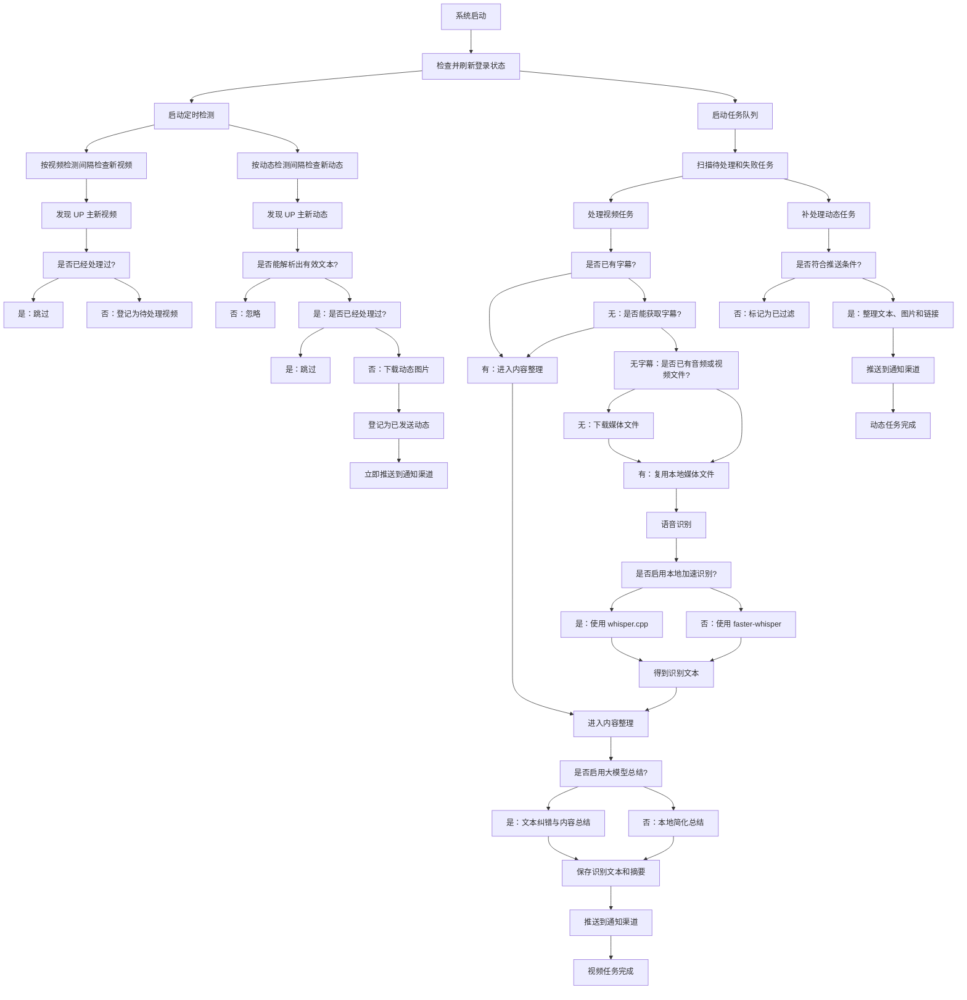

# 全链路流程图

```mermaid
flowchart TD
    A["系统启动"] --> B["检查并刷新登录状态"]
    B --> C["启动定时检测"]
    B --> D["启动任务队列"]

    C --> C1["按视频检测间隔检查新视频"]
    C --> C2["按动态检测间隔检查新动态"]

    C1 --> V1["发现 UP 主新视频"]
    V1 --> V2["是否已经处理过?"]
    V2 --> V3["是：跳过"]
    V2 --> V4["否：登记为待处理视频"]

    D --> W0["扫描待处理和失败任务"]
    W0 --> W1["处理视频任务"]
    W1 --> W2["是否已有字幕?"]
    W2 --> W3["有：进入内容整理"]
    W2 --> W4["无：是否能获取字幕?"]
    W4 --> W3
    W4 --> W5["无字幕：是否已有音频或视频文件?"]
    W5 --> W6["无：下载媒体文件"]
    W5 --> W7["有：复用本地媒体文件"]
    W6 --> W7
    W7 --> W8["语音识别"]
    W8 --> W9["是否启用本地加速识别?"]
    W9 --> W10["是：使用 whisper.cpp"]
    W9 --> W11["否：使用 faster-whisper"]
    W10 --> W12["得到识别文本"]
    W11 --> W12
    W3 --> L1["进入内容整理"]
    W12 --> L1
    L1 --> L2["是否启用大模型总结?"]
    L2 --> L3["是：文本纠错与内容总结"]
    L2 --> L4["否：本地简化总结"]
    L3 --> L5["保存识别文本和摘要"]
    L4 --> L5
    L5 --> L6["推送到通知渠道"]
    L6 --> L7["视频任务完成"]

    C2 --> D1["发现 UP 主新动态"]
    D1 --> D2["是否能解析出有效文本?"]
    D2 --> D3["否：忽略"]
    D2 --> D4["是：是否已经处理过?"]
    D4 --> D5["是：跳过"]
    D4 --> D6["否：下载动态图片"]
    D6 --> D7["登记为已发送动态"]
    D7 --> D8["立即推送到通知渠道"]

    W0 --> P1["补处理动态任务"]
    P1 --> P2["是否符合推送条件?"]
    P2 --> P3["否：标记为已过滤"]
    P2 --> P4["是：整理文本、图片和链接"]
    P4 --> P5["推送到通知渠道"]
    P5 --> P6["动态任务完成"]
```

## 说明

- 视频业务链路是 `发现新视频 -> 下载/复用媒体 -> 语音识别 -> 文本总结 -> 推送通知`
- 动态业务链路是 `发现新动态 -> 去重 -> 下载图片 -> 推送通知`
- 失败或积压的任务会进入队列继续补处理，直到完成、过滤或重试失败

